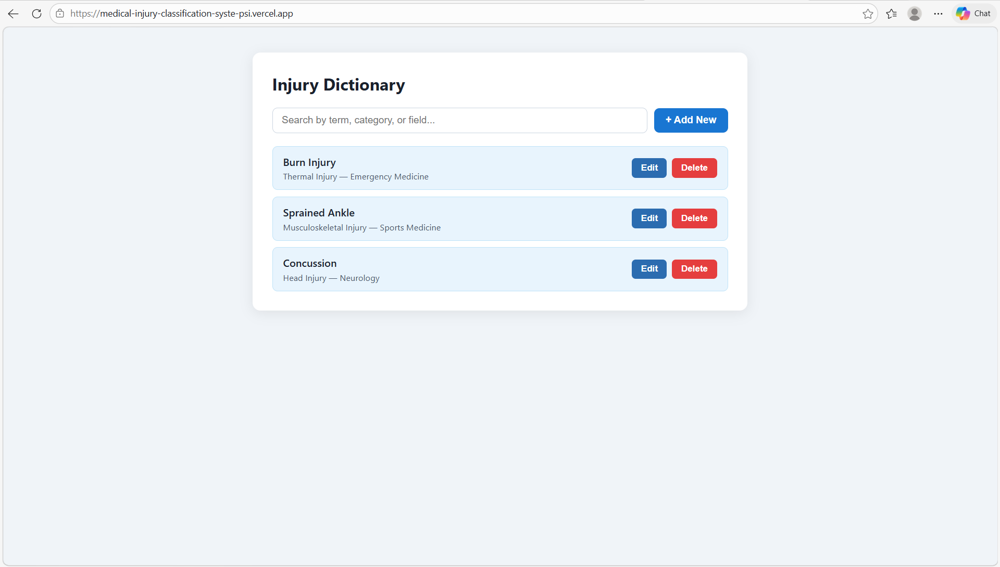
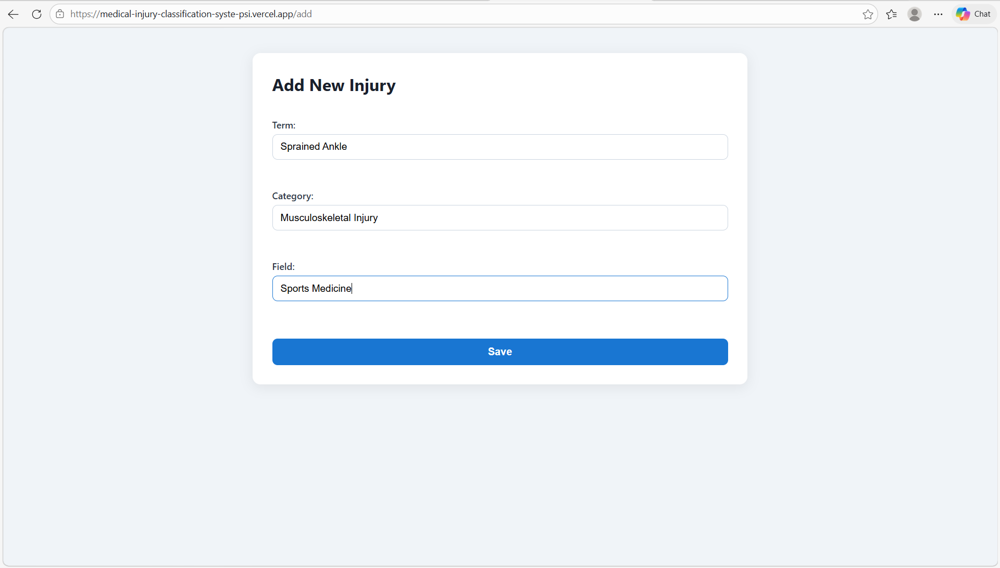

# Medical Injury Classification System

A full-stack web application to manage, search, and perform CRUD operations on medical injury terms like *Abrasion, **Gunshot Wound*, etc.

# 🩺 Medical Injury Classification System

A full-stack web application to **manage, search, and perform CRUD operations** on medical injury terms such as *Abrasion*, *Gunshot Wound*, and more.

🔗 **Live Demo:** [https://medical-injury-classification-syste-psi.vercel.app](https://medical-injury-classification-syste-psi.vercel.app)

---

## 📋 Table of Contents

- [Features](#features)
- [Tech Stack](#tech-stack)
- [Project Structure](#project-structure)
- [Getting Started](#getting-started)
  - [Prerequisites](#prerequisites)
  - [Database Setup](#database-setup)
  - [Backend Setup](#backend-setup)
  - [Frontend Setup](#frontend-setup)
- [Environment Variables](#environment-variables)
- [API Endpoints](#api-endpoints)
- [Deployment](#deployment)
- [Screenshots](#screenshots)

---

## ✨ Features

- 📄 View all medical injury terms
- 🔍 Real-time search by term, category, or field
- ➕ Add new injury records
- ✏️ Edit existing injury records
- 🗑️ Delete injury records with confirmation
- ☁️ Deployed backend on Render, frontend on Vercel

---

## 🛠 Tech Stack

| Layer | Technology |
|-------|-----------|
| Frontend | React.js, React Router v7, Axios |
| Backend | Node.js, Express.js |
| Database | MySQL (Aiven Cloud) |
| Hosting | Vercel (frontend), Render (backend) |

---

## 📁 Project Structure

```
Medical-Injury-Classification/
│
├── injury-backend/
│   ├── controllers/
│   │   └── injuryController.js   # CRUD logic
│   ├── routes/
│   │   └── injuryRoutes.js       # API routes
│   ├── db.js                     # MySQL connection pool
│   ├── server.js                 # Express server entry point
│   ├── Database.sql              # SQL schema
│   └── .env                      # Environment variables (not committed)
│
├── injury-frontend/
│   ├── public/
│   ├── src/
│   │   ├── components/
│   │   │   ├── InjuryList.js     # List, search, edit, delete
│   │   │   └── InjuryForm.js     # Add / Edit form
│   │   ├── App.js                # Routes
│   │   ├── index.js
│   │   └── index.css
│   └── package.json
│
└── README.md
```

---

## 🚀 Getting Started

### Prerequisites

Make sure you have the following installed:

- [Node.js](https://nodejs.org/) v14 or higher
- [npm](https://www.npmjs.com/)
- [MySQL](https://www.mysql.com/) (local) or an [Aiven](https://aiven.io/) cloud MySQL instance

---

### Database Setup

1. Open MySQL Workbench or your preferred MySQL client
2. Run the following SQL:

```sql
CREATE DATABASE injury_db;
USE injury_db;

CREATE TABLE injury_dictionary (
  id VARCHAR(36) PRIMARY KEY,
  term VARCHAR(255) NOT NULL,
  category VARCHAR(100) NOT NULL,
  field VARCHAR(100) NOT NULL
);
```

> ℹ️ The table is also auto-created on backend start if it doesn't exist.

---

### Backend Setup

```bash
# Navigate to the backend folder
cd injury-backend

# Install dependencies
npm install express mysql2 cors dotenv uuid

# Create your .env file (see Environment Variables section)

# Start the server
npm start
```

Server runs on: `http://localhost:5000`

---

### Frontend Setup

```bash
# Navigate to the frontend folder
cd injury-frontend

# Install dependencies
npm install axios react-router-dom

# Start the app
npm start
```

App runs on: `http://localhost:3000`

---

## 🔐 Environment Variables

Create a `.env` file inside the `injury-backend/` folder:

```env
DB_HOST=your_mysql_host
DB_USER=your_mysql_user
DB_PASSWORD=your_mysql_password
DB_NAME=injury_db
DB_PORT=3306
PORT=5000
```

> ⚠️ Never commit your `.env` file. It is already listed in `.gitignore`.

If using **Aiven Cloud MySQL**, get the values from your Aiven console under **Connection Information**. Aiven typically uses a non-standard port (e.g. `14485`).

---

## 📡 API Endpoints

Base URL (production): `https://injury-backend-kwmv.onrender.com`

| Method | Endpoint | Description |
|--------|----------|-------------|
| GET | `/api/injuries` | Get all injuries |
| GET | `/api/injuries/:id` | Get a single injury by ID |
| GET | `/api/injuries/search?q=term` | Search injuries |
| POST | `/api/injuries` | Create a new injury |
| PUT | `/api/injuries/:id` | Update an injury |
| DELETE | `/api/injuries/:id` | Delete an injury |

### Request Body (POST / PUT)

```json
{
  "term": "Abrasion",
  "category": "Skin Injury",
  "field": "Dermatology"
}
```

---

## ☁️ Deployment

### Backend — Render

1. Push your code to GitHub
2. Go to [Render](https://render.com) → **New Web Service**
3. Connect your GitHub repo and select the `injury-backend` folder
4. Set **Build Command:** `npm install`
5. Set **Start Command:** `node server.js`
6. Add all environment variables under **Environment**
7. Deploy

### Frontend — Vercel

1. Go to [Vercel](https://vercel.com) → **New Project**
2. Connect your GitHub repo and select the `injury-frontend` folder
3. Vercel auto-detects Create React App — click **Deploy**

> 🔁 The Render free tier spins down after inactivity. The first request after idle may take ~30–50 seconds.

---

## 📸 Screenshots

> _Add screenshots of your app here_

| Injury List | Add / Edit Form |
|-------------|----------------|
|  |  |

---

## 👤 Author

**Harsha** — [GitHub](https://github.com/H24-D)

---

## 📄 License

This project is open source and available under the [MIT License](LICENSE).
